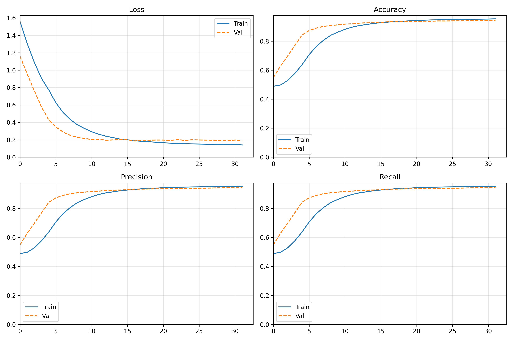

# Mgauss-Android

[cite_start]Mgauss is a cross-platform mobile application developed in Kotlin using Jetpack Compose[cite: 1], designed to serve as a safety tool for industrial workers operating in hazardous environments. 

[cite_start]By utilizing a lightweight, ~140,000 parameter machine learning model powered by TensorFlow Lite[cite: 4], the app effectively detects electrical anomalies and nearby active AC devices using only the device's built-in magnetometer and rotation vector sensors. The model achieves an impressive 90-91% validation accuracy. 

When an active device is detected, Mgauss alerts the user locally via haptics and an alarm tone, and broadcasts a UDP alert over the local Wi-Fi network to warn other workers running the app in the vicinity.



## How It Works

The application architecture is modularized into several managers that handle data collection, local inference, and mesh-like network alerts.

### 1. Data Collection (`SensorManager`)
The `SensorManager` acts as the brain of the application. It captures uncalibrated Magnetometer and Rotation Vector (Quaternion) data at a high frequency. The raw data is continuously appended to a rolling buffer keeping the last 1.5 seconds of data. Once the buffer holds enough data, the manager triggers the inference engine every 100 milliseconds (resulting in a 10Hz inference rate, or 10 times a second).

### 2. Signal Processing & Inference (`InferenceEngine`)
Before being fed into the TensorFlow Lite model (`Magdroid_model.tflite`), the raw sensor data undergoes a rigorous preprocessing pipeline:
* **Filtering:** The data passes through a zero-phase Butterworth-style filter (`filtfilt`) to remove high-frequency noise.
* **Frame Rotation:** Using the rotation vector's quaternion data, the magnetometer readings are rotated from the device's local frame of reference to the Earth's global frame.
* **Interpolation:** The data is interpolated to a strict 100Hz grid to ensure uniform time steps.
* **Normalization:** The engine calculates a `sigma` (standard deviation) value, stores it, and applies a global Z-score normalization to the waveform.
* **Prediction:** The normalized waveform and the `sigma` value are passed to the TFLite inference engine.

### 3. State Management & Alerts
Based on the inference confidence, the `SensorManager` dictates the UI state and alert triggers:
* **Device Detected:** If the model's confidence for "Device" is **≥ 75%**, the app state shifts, triggering local haptics, an alarm tone, and a high-priority push notification. It also triggers a burst mode network alert. 
* **Neutral State:** To prevent UI flickering, a hysteresis loop is used. The state only returns to "Neutral" if the device probability drops **< 30%**.

### 4. Local Network Broadcasting (`UDPManager`)
When an anomaly is detected, `UDPManager` packages the alert in JSON with a unique device UUID and broadcasts it to the local network on port `8888`. It utilizes a `WifiManager` Multicast Lock to ensure robust transmission. Simultaneously, the app listens on this port for incoming alerts from other devices, ensuring all workers in the network are notified of a hazard.

### 5. Background Execution (`ScanningService`)
To ensure workers remain protected even when the phone is locked or the app is minimized in the background, `ScanningService` runs as an Android Foreground Service. The `SensorManager` strictly utilizes a `Partial WakeLock` and a `WifiLock` to prevent the Android OS from suspending sensor collection and network capabilities while the screen is off.

## Installation & Setup

To run Mgauss on your local machine and deploy it to your Android device:

1. **Clone the repository:**
   ```bash
   git clone 

2. **Open in Android Studio:**
Open the project in Android Studio. Ensure your Gradle sync completes successfully. The application requires a minimum SDK of API 26 (Android 8.0).

3. **Build and Run:**
Connect your Android device to your computer and ensure USB Debugging is enabled. Select your device from the run destination menu at the top of Android Studio, and hit the Play button (or Shift + F10) to compile and install the app. Upon launching, accept the requested permissions for notifications and sensor access.

> **Note:** Emulator testing will not yield accurate results as it lacks the physical magnetometer and environmental noise required for detection.

---

## Capabilities & Detection Range

The app's detection range relies on the strength of the electromagnetic field generated by the target AC device. When the mobile device is brought near an active AC source, the UI will shift to the "Device" state.

* **High-Power Devices:** Machinery, microwaves, and ceiling fans can typically be detected from distances exceeding 20 cm.
* **Low-Power Devices:** Smaller electronics like wall switches, phone chargers, and minor appliances have a more localized field and require closer proximity to trigger an alert.